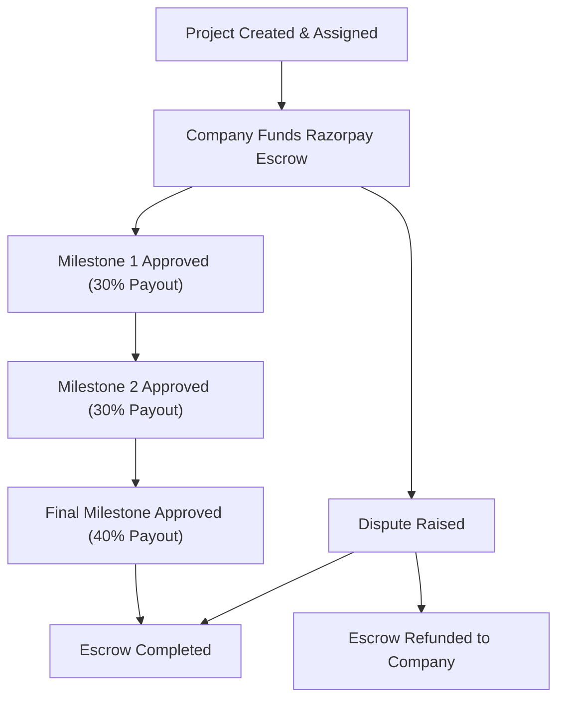

<div align="center">

# 🚀 FUTURE PILOT ECOSYSTEM
### *India's Largest Student Freelancing & Industry Project Ecosystem*

[](https://nextjs.org/)
[](https://react.dev/)
[](https://www.typescriptlang.org/)
[](https://tailwindcss.com/)
[](https://firebase.google.com/)
[](LICENSE)

<p align="center">
  <b>Bridging the Gap Between Higher Education & Real Industry Execution</b><br />
  Work on Real Projects • Earn Real Money • Graduate Industry-Ready
</p>

</div>

---

## 🌟 Executive Overview

**Future Pilot** is a next-generation edtech and talent ecosystem designed to permanently resolve the Indian higher education paradox: *"Need experience to get a job, need a job to get experience."*

By connecting **Students**, **Universities**, **Corporate Enterprises**, and **Senior Industry Mentors** on a unified digital platform, Future Pilot enables students to work on production-grade corporate deliverables, earn financial rewards, unlock XP gamification badges, and build a verified portfolio while in college.

---

## 🏛️ Ecosystem Portals & Feature Matrix

Future Pilot features 5 dedicated role-tailored portals protected by Role-Based Access Control (RBAC):

### 1. 🎓 Student Pilot Portal (`/student/*`)
- **Real Industry Projects**: Browse pre-vetted corporate projects matched by domain and difficulty.
- **XP Gamification & Levels**: Gain XP for milestone completion (Explorer ➔ Builder ➔ Innovator ➔ Expert ➔ Elite Pilot ➔ Future Legend).
- **Escrow Wallet**: Track wallet balances, milestone payouts, and request instant withdrawals.
- **Verified Digital Portfolio**: Display completed projects, GitHub code links, and verified certificates.
- **University Leaderboards**: Compete on global, campus, and department rankings.

### 2. 🏢 Corporate Enterprise Portal (`/company/*`)
- **Project Scope & Publishing**: Define project milestones, required tech stacks, budgets, and delivery timelines.
- **Corporate KYC & Verification**: Submit GSTIN and business credentials for trusted partner status.
- **Razorpay Escrow Lock**: Deposit project funds securely into escrow prior to project commencement.
- **Candidate Pipeline**: Review AI-screened and pre-vetted student applications.
- **Deliverable Approval**: Approve completed code milestones to trigger automated payout releases.

### 3. 🏫 University & College Portal (`/college/*`)
- **Student Performance Analytics**: Real-time tracking of student participation, project completions, and cumulative earnings.
- **Corporate Partnerships**: Manage MOUs with hiring corporate partners.
- **Campus Placement Readiness**: Track the Industry Readiness Index (IRI) across departments (CSE, IT, ECE, ME).

### 4. 👨‍🏫 Senior Mentor Workspace (`/mentor/*`)
- **Milestone Code Reviews**: Inspect student deliverable submissions, provide feedback, or request revisions.
- **Mentorship Meetings**: Host 1-on-1 and group live guidance sessions.
- **Rating Matrix**: Build mentor reputation ratings based on student feedback.

### 5. 🛡️ Admin Command Center (`/admin/*`)
- **Ecosystem Oversight**: Global metrics on total registered students, active projects, and locked financial escrow.
- **Approvals Queue**: Review pending Corporate KYC submissions, project postings, and escrow release requests.
- **Live Activity Feed**: Monitor real-time platform registrations, applications, and certificate issuances.

---

## ⚡ Tech Stack & Architecture

| Layer | Technologies Used |
| :--- | :--- |
| **Framework** | **Next.js 16.2.12** (App Router, Turbopack, Server Actions) |
| **Frontend UI** | **React 19**, **Tailwind CSS v4**, Glassmorphism CSS, Space Grotesk Font |
| **Animations** | **Framer Motion 12**, Canvas WebGL Particles, GSAP |
| **Authentication** | **Firebase Auth** (Email/Password + Google Provider) + Multi-Role Demo Fallback |
| **Database** | **Firebase Firestore** (NoSQL Data Models, Server Timestamps) |
| **Financial Escrow** | **Razorpay Payments** API & Webhook Handler (`/api/webhooks/razorpay`) |
| **Icons & Media** | Lucide React |

---

## 🔒 Financial Escrow Lifecycle

Future Pilot enforces a zero-risk financial state machine for both companies and students:



---

## 📁 Repository Structure

```
FP ECOSYSTEM/
├── src/
│   ├── app/
│   │   ├── (auth)/             # Login, Register, Forgot Password, Onboarding
│   │   ├── (dashboard)/        # Unified Dashboard Shell
│   │   │   ├── admin/          # Admin Command Center Routes
│   │   │   ├── college/        # University Portal Routes
│   │   │   ├── company/        # Corporate Workspace Routes
│   │   │   ├── mentor/         # Mentor Workspace Routes
│   │   │   └── student/        # Student Pilot Portal Routes
│   │   ├── api/                # Application & Webhook API Routes
│   │   ├── globals.css         # Tailwind v4 Design Tokens & Aesthetics
│   │   ├── layout.tsx          # Root Layout & Font Definitions
│   │   └── page.tsx            # Cinematic Landing Page
│   ├── components/
│   │   ├── animations/         # Framer Motion Text & Counter Effects
│   │   ├── layout/             # Sidebar, Topbar, Navbar, Footer
│   │   ├── providers/          # AuthProvider, AuthGuard, ToastProvider
│   │   ├── sections/           # Landing Page Act Sections
│   │   ├── three/              # Canvas WebGL Backgrounds & Particles
│   │   └── ui/                 # Reusable UI Design System (Cards, Badges, Buttons)
│   ├── config/                 # RBAC Matrix & Site Metadata Constants
│   ├── hooks/                  # Custom React Hooks (useAuth)
│   ├── lib/                    # Firebase SDK Utilities & Helpers
│   ├── services/               # Escrow, Auth, Student, Company & Admin Services
│   └── types/                  # Type-Safe Platform Interface Definitions
├── public/                     # Static Assets & Icons
├── .env.local.example          # Environment Variable Configuration Template
├── next.config.ts              # Next.js Build Configuration
├── package.json                # Project Dependencies & Scripts
└── README.md                   # Repository Documentation
```

---

## 🛠️ Getting Started

### Prerequisites

- **Node.js**: `v18.17.0` or higher
- **Package Manager**: `npm` (v9+) or `pnpm`

### Installation

1. **Clone the Repository**:
   ```bash
   git clone https://github.com/parimeena404/FP-Ecosystem.git
   cd FP-Ecosystem
   ```

2. **Install Dependencies**:
   ```bash
   npm install
   ```

3. **Configure Environment Variables**:
   Copy `.env.local.example` to `.env.local`:
   ```bash
   cp .env.local.example .env.local
   ```
   *Note: If Firebase credentials are left blank, Future Pilot automatically runs in local **Multi-Role Demo Mode**.*

4. **Launch Development Server**:
   ```bash
   npm run dev
   ```
   Open [http://localhost:3000](http://localhost:3000) in your browser.

5. **Build for Production**:
   ```bash
   npm run build
   npm start
   ```

---

## ⚡ Instant Multi-Role Demo Mode

To allow instant previewing of all 5 platform portals without requiring live Firebase authentication keys, Future Pilot includes a **1-Click Demo Mode**:

1. Navigate to `/login`.
2. Scroll to the **Quick Demo Role Access** panel at the bottom.
3. Click any portal button (**Student**, **Company**, **University**, **Mentor**, or **Admin**) to immediately log in and explore that role's complete workspace.

---

## 📄 License

This project is licensed under the **MIT License** — see the [LICENSE](LICENSE) file for complete details.

---

<div align="center">
  <sub>Built with ❤️ by the <b>Future Pilot Team</b> • Empowering the Next Generation of Indian Engineers</sub>
</div>
